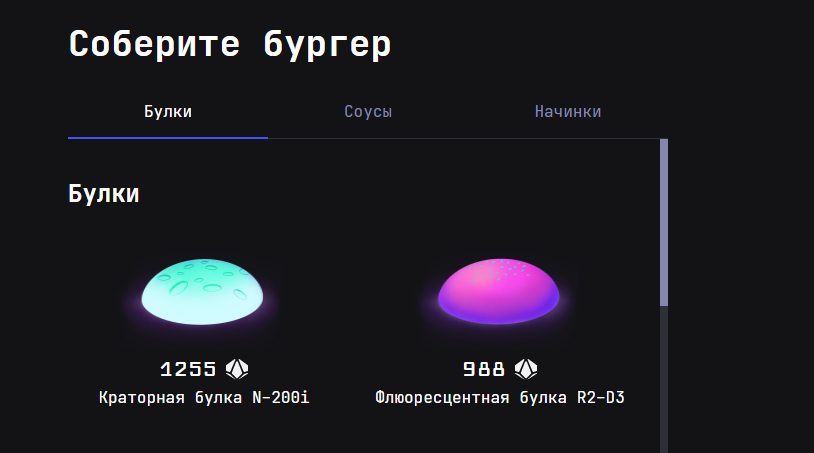
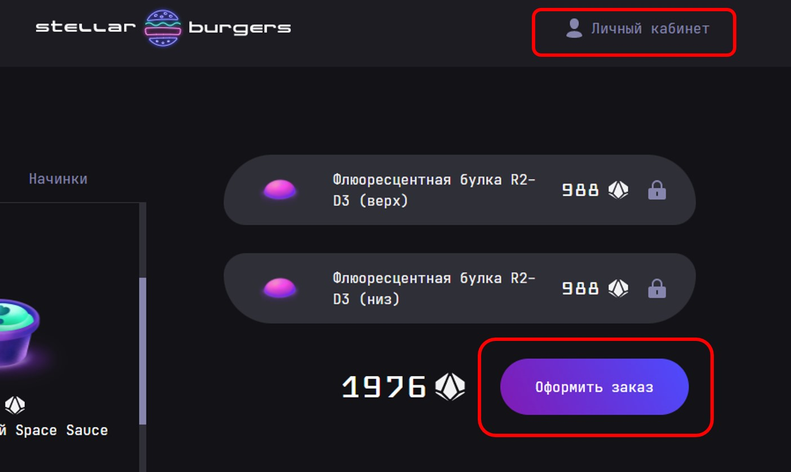
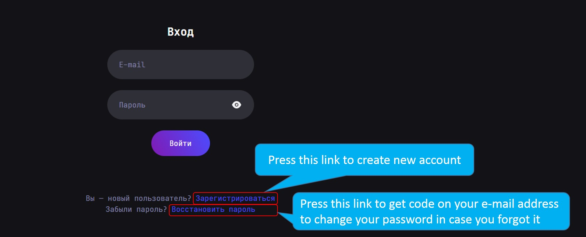
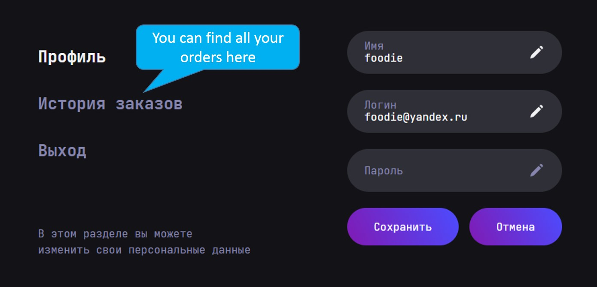
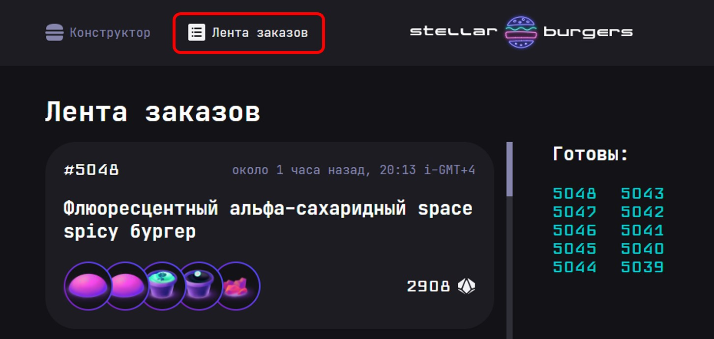
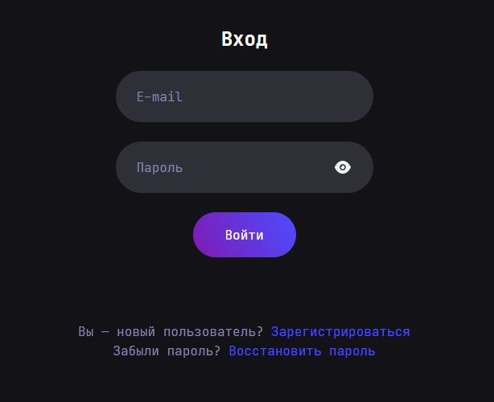
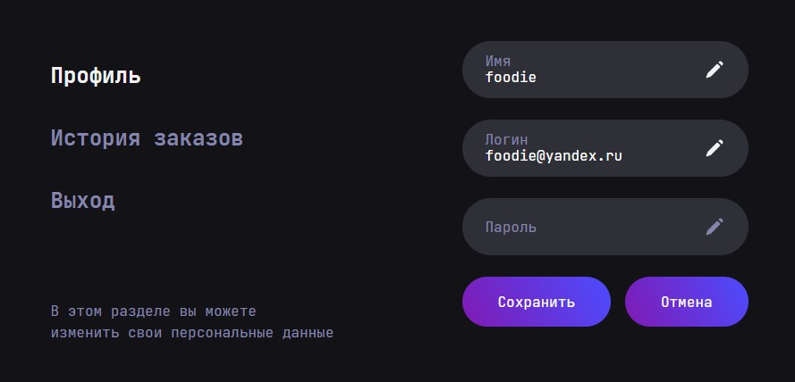

EN and RUS description

# Stellar burgers website  

Welcome to the Stellar burgers website! Stella burgers is space burgers restaurant, open for all foodies!

## Demo link:  

You can visit the app at https://react-burger-f9d9ibv6g-evgeniiazu8ova.vercel.app/  

## Table of Content:  

* About The App   
* Technologies  
* Setup  
* Status  

## About The App  

This app is available in Russian language only at the moment, because API data is available only in Russian.  

First of all, you will get on homepage, where you can see the list of available burgers ingredients (buns, sauces and fillings).  

  

To add necessary items to your cart, click and drag the item to the right part of the screen. 

  

You need to be authorized to get access to making order. If you will try to make an order by click on make order button, you will be redirected to login page, where you can log into your account or create profile if you are not registered yet. You also can get to your profile page by click on user profile link at the top right part of the screen.  

  

  

If you are authorized, you can get to your profile page by click on user icon at the top right part of the screen. On this page your can change your name and also you can see all your orders.  

  

You can see all orders and their status by click all orders link.  

  

## Technologies  

This app covers such technologies, as: React, Redux, TypeScript, JavaScript, Cypress, Drag and Drop.  

## Setup  

* Download or clone the repository  
* Run 'npm install'  
* Run 'npm start'  

## Status  

It is important to know, that this app does not have mobile layout at the moment, that is why it will be shown correctly only on desktop. 

# Сайт космической бургерной Stellar burgers  

Добро пожаловать на страницу Stellar Burgers! Stella burgers - это космическая бургерная, двери которой открыты для всех любителей вкусно поесть!

## Ссылка на сайт:  

Сайт доступен по ссылке: https://react-burger-f9d9ibv6g-evgeniiazu8ova.vercel.app/  

## Содержание:  

* О приложении  
* Технологии 
* Установка  
* Текущий статус  

## О приложении  

В настоящий момент у приложения есть только русскоязычная версия, поскольку данные с API доступны только на русском языке.  

Изначально вы попадаете на домашнюю страницу, где можно увидеть доступные ингредиенты для бургеров (булочки, соусы и начинки).  

  

Чтобы добавить понравившийся ингредиент в корзину, кликните по нему и перетащите его в правую часть экрана.

  

Для того, чтобы сделать заказ, вы должны быть авторизованы. Если вы попробуете сделать заказ, нажав на кнопку "Оформить заказ", будучи неавторизованым, вы будете перенаправлены на страницу авторизации, где вы сможете войти в свой аккаунт или зарегистрироваться, если у вас ещё нет учётной записи. Также вы можете попасть на страницу авторизации, кликнув на иконку личного кабинета в правом верхнем углу.  

  

  

Если вы авторизованы, вы можете войти в личный кабинет, кликнув на соответствующую иконку в правом верхнем углу. В личном кабинете вы можете изменить своё имя пользователя, а также просмотреть все свои заказы.

  

Вы можете просмотреть все заказы и их статус, кликнув на кнопку "Лента заказов".

  

## Технологии  

При разработке приложения использовались такие технологии, как: React, Redux, TypeScript, JavaScript, Cypress, Drag and Drop.  

## Установка  

* Скачайте или клонируйте репозиторий  
* Запустите команду 'npm install'  
* Запустите команду 'npm start'  

## Текущий статус  

Важное замечание: в данный момент у приложения нет мобильной версии, поэтому оно будет отображаться корректно только на больших разрешениях. 
